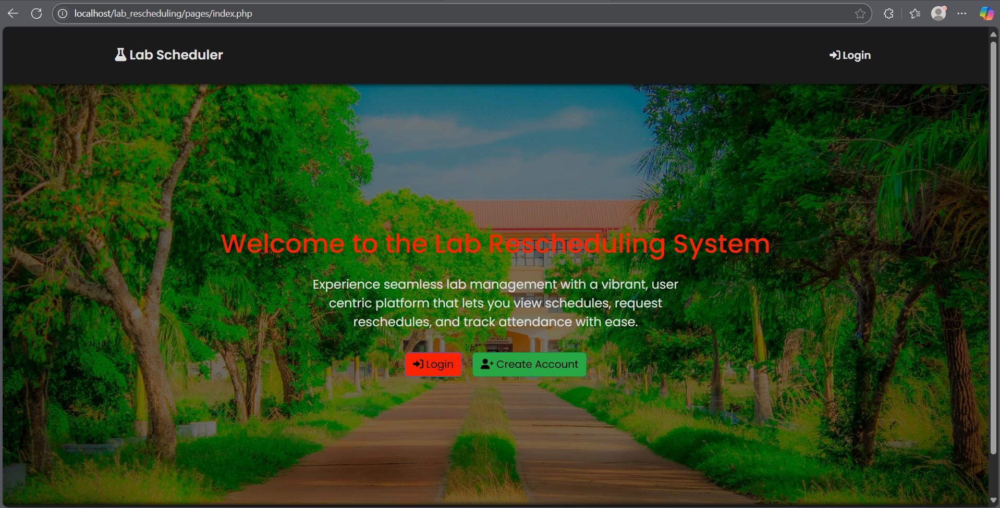

# 🎓 Lab Rescheduling Management System
<div align="center">
  
</div><br>

## ✨ Features

- 🎯 **Role-Specific Dashboards**  
  - **Students**: View schedules, request reschedules, check status, view attendance  
  - **Coordinators**: Create/manage schedules, review & forward requests, monitor attendance  
  - **Instructors**: View assigned labs, schedule approved reschedules, update attendance  
  - **Admins**: Oversee all schedules & requests, generate logs  
- 📅 **Dynamic Scheduling**  
  - AJAX-powered semester→subject filtering  
  - Course code as the primary identifier  
- 🔄 **Multi-Stage Approval Workflow**  
  1. Student submits request + uploads document  
  2. Admin approves/rejects & assigns coordinator  
  3. Coordinator forwards/rejects & assigns instructor  
  4. Instructor schedules new session 
- 📝 **Attendance Module** with present/absent tracking  
- ⚡ **Responsive & Modern UI** (Bootstrap 5 + custom styles)  
- 🔒 **Secure File Uploads** & prepared statements  
- 📊 **Reporting & Logs** for usage tracking  
---
<br>

## 🛠 Tech Stack
| Layer              | Technology                  |
|--------------------|-----------------------------|
| Backend            | PHP 8+, MySQL               |
| Frontend           | Bootstrap 5, HTML5, CSS3, JS|

---
<br>

## 📁 File Structure

```
lab_rescheduling/
├── assets/
│   ├── css/
│   │   └── styles.css
│   ├── js/
│   │   └── scripts.js
│   └── uploads/
├── includes/
│   ├── db.php
│   ├── mail.php
│   ├── authenticate.php
│   ├── save_details.php
│   └── logout.php
├── templates/
│   ├── header.php
│   └── footer.php
├── pages/
│   ├── index.php
│   ├── register.php
│   ├── login.php
│   ├── select_details.php
│   └── dashboard/
│         ├── student_dashboard.php
│         ├── coordinator_dashboard.php
│         ├── instructor_dashboard.php
│         └── admin_dashboard.php
├── lab/
│   ├── schedule.php
│   ├── update_schedule.php
│   ├── delete_schedule.php
│   ├── request_reschedule.php
│   ├── submit_reschedule.php
│   ├── request_status.php
│   ├── review_requests.php
│   ├── process_review.php
│   ├── attendance.php
│   ├── update_attendance.php
│   └── delete_attendance.php
├── config.php
└── lab_rescheduling.sql
```
---
<br>

## ⚙️ Installation & Setup

1. **Clone the repository**
```bash
git clone https://github.com/DewmikaSenarathna/Lab_Rescheduling_Management_System.git
cd lab_rescheduling
```

2. **Set up MySQL database**
   - Create a DB named `lab_rescheduling`
   - Import `lab_rescheduling.sql`

3. **Configure app**
```bash
cp config.php
```

4. **Run via XAMPP**
```
http://localhost/lab_rescheduling/pages/index.php
```

---
<br>

## 🔧 Configuration

Edit `config.php`:

```php
define('DB_HOST', 'localhost');
define('DB_USER', 'root');
define('DB_PASS', '');
define('DB_NAME', 'lab_rescheduling');

define('EMAIL_HOST', 'smtp.example.com');
define('EMAIL_USERNAME', 'you@example.com');
define('EMAIL_PASSWORD', 'yourpassword');
define('EMAIL_FROM', 'noreply@lab-system.com');
define('EMAIL_FROM_NAME', 'Lab Scheduler');
```

---

<br>

## 📚 Usage

- Register & login as your role
- Set semester & subjects/labs
- Interact via your dashboard
- Email alerts track request stages

---

<br>

## 📄 License

MIT License – see the [LICENSE](LICENSE) file

---

<br>

## ✉️ Contact

**GitHub:** [Dewmika Senarathna](https://github.com/DewmikaSenarathna)  
**Project Link:** [https://github.com/DewmikaSenarathna/Lab_Rescheduling.git](https://github.com/DewmikaSenarathna/Lab_Rescheduling_Management_System.git)
